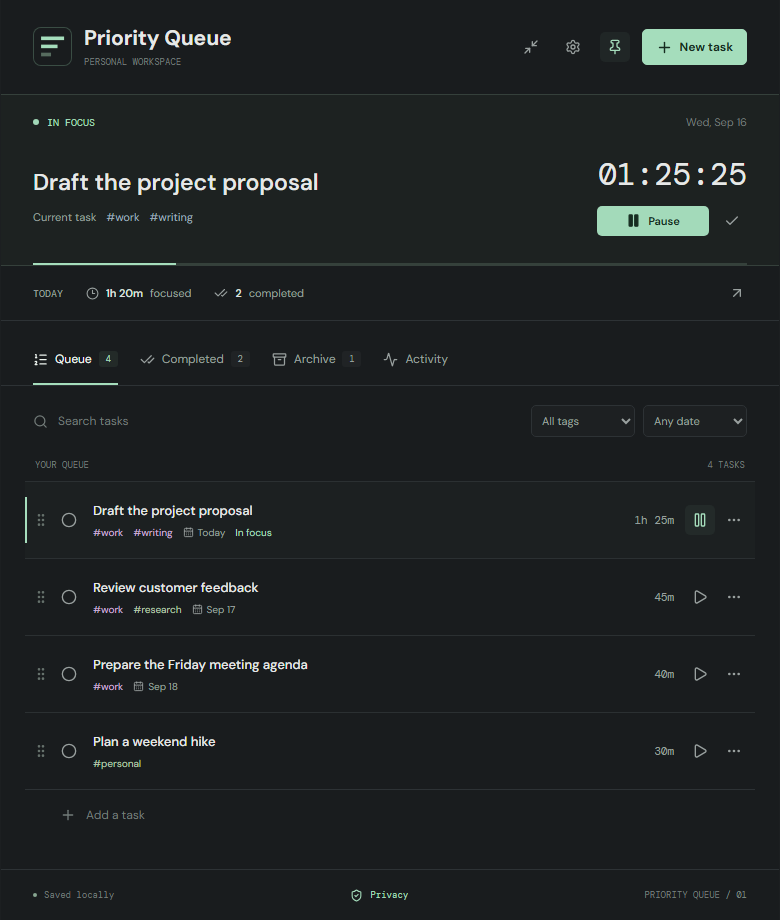
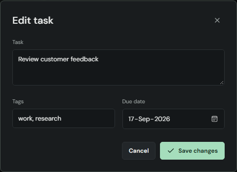
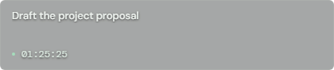
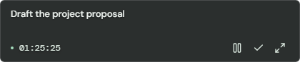
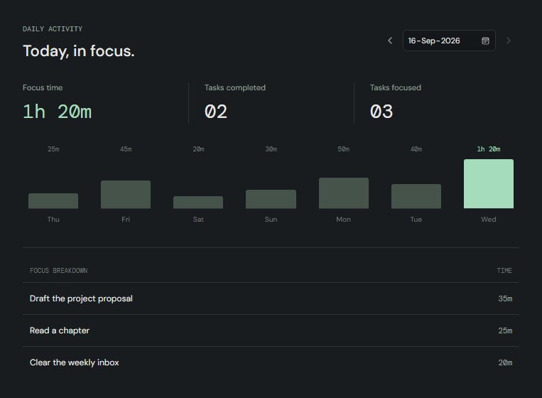
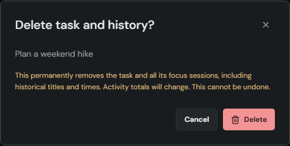
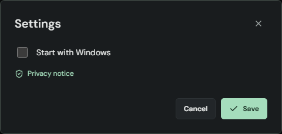

# Priority Queue

**Keep your next task in sight.** A local-first Windows focus companion with an ordered task list, a translucent floating overlay, and time tracking for the work you choose to do.

[Download for Windows](https://github.com/ravindraakula94/priority-queue/releases/latest) | [Get started](#get-started) | [Explore the features](#make-your-queue) | [Keyboard shortcuts](#keyboard-shortcuts) | [Privacy](PRIVACY.txt)

*Real Windows app screenshots with fictional tasks. This guide describes v1.0.0.*

> **v1.0.0:** Includes encrypted local storage, permanent task/history deletion, and the offline Privacy notice. The installer is self-signed by **Ravindra Akula** and timestamped. This is not a publicly trusted certificate: Windows may still warn about an unknown publisher. Read the release notes, especially the encryption migration warning, before upgrading from v0.2.0 or earlier.

## Get started

1. Open [Releases](https://github.com/ravindraakula94/priority-queue/releases/latest) and download the Windows x64 file ending in **`-setup.exe`**, not the source-code archive.
2. Run the installer, then launch **Priority Queue** from the Start menu. It installs for your Windows user and downloads Microsoft WebView2 if needed. You do not need Node.js, Rust, or .NET to use the app.
3. On first launch, choose whether to **Start with Windows**, then select **Continue**. Leave the box unchecked to keep automatic startup off; **Not now** postpones the choice.
4. The app opens in mini mode. Hover over it and select **Expand to full view**, or press **Ctrl+Shift+M** while the app has focus.
5. Select **New task**, add something you want to work on, and select **Start focus**. Pause when you take a break.

Windows 10/11 x64 is the supported desktop experience. Windows may warn about an unknown publisher: verify the download and release notes before deciding to run it. Do not disable Windows security to install the app.

## Make your queue

Write down the next few things you want to do, then put them in the order you want to tackle them. The first queued task is offered when no task is selected for focus.

- **Add or edit:** select **New task** or click an existing task title. Add comma-separated tags and an optional due date.
- **Prioritize:** drag a row's handle, or use its three-dot menu to **Move up** or **Move down**. Keyboard reordering is supported too.
- **Find work quickly:** search task titles and tags, filter by a tag, or choose due today, overdue, or no due date. Filters can be combined.
- **Keep context:** each row shows its accumulated focus time. Tags and due dates help distinguish work, personal plans, and deadlines.

**Try this:** use a task title that tells you what to do when you return, such as "Draft the project proposal" rather than just "Project." Keep the next action at the top so you do not have to choose again after every distraction.

## Focus on one task

Select the play button beside any queued task, or **Start focus / Resume** in the focus panel. Only one task runs at a time; switching tasks records the time already spent and starts the new one.

- **Pause and resume** without counting the break.
- **Track actual work:** the focus timer shows the selected task's accumulated time, not a countdown. The **Today** strip shows time across tasks for the current day.
- **Complete intentionally:** in full view, completing the focused task stops its timer. The next task does not start until you choose it.
- **Return safely:** reopening restores your focused task paused, without counting time while the app was closed.
- **Lock your PC:** Windows lock events pause tracking. Unlocking does not resume it automatically.

Switching to another application or minimizing Priority Queue does **not** pause the timer. Pause before putting an unlocked PC to sleep; sleep without a screen lock can count as focus time.

## Keep it visible with mini mode

Press **Ctrl+Shift+M**, or use the compact-overlay button beside Settings, to reduce the app to a small always-on-top strip. The current task and timer stay visible while you work in another window.

**At rest**

**With controls revealed**

- **Hover or use Tab** to reveal pause/resume, complete-and-next, and expand controls.
- **Drag the title or timer** to move the overlay. Drag a window edge or corner to resize it; the minimum is 320 x 88 and the initial size is 420 x 88.
- **Keep your placement:** size and position are remembered across launches. If your monitor layout changes, the overlay is brought back into an available screen's work area.
- **Continue through your queue:** completing in mini mode loads the first remaining task. If the timer was running, it continues on that task; if paused, it stays paused. An empty queue stops tracking.
- **Expand when needed:** return to the prior full-window size, position, maximized state, and pin setting. Switching views alone never starts or stops tracking.

The strip accepts mouse input so its controls work; it is not click-through. In full view, the pin button lets you switch always-on-top on or off. Mini mode is always on top.

## See where your time went

Open **Activity** or select the arrow beside the Today totals.

Use the date picker, previous/next arrows, or a chart bar to inspect a day. You can see:

- Total focus time, number of tasks completed, and number of tasks focused.
- A seven-day view of your focus time.
- A per-task breakdown, ordered by time spent.

Daily totals follow your local calendar, including sessions that cross midnight. The selected task's all-time timer and the day's total can therefore show different values.

**Try this:** at the end of a day, compare the breakdown with what you meant to prioritize. Reorder tomorrow's queue before closing the app.

## Finish, archive, or delete

| Action | What happens |
| --- | --- |
| **Complete** | Moves the task to **Completed** and records its completion time. History remains. |
| **Archive** | Moves the task out of the active queue without deleting its history. |
| **Restore / Return to queue** | Brings the task back to the queue and clears its completed status. |
| **Delete** | After confirmation, permanently removes the task and its entire focus history. Other tasks are unchanged. |

Deletion changes activity totals and has no undo after a successful save. If you see **Save failed**, use **Retry save** before closing; removal is not durable until saving succeeds. Archive instead of deleting when you want to keep the record.

Older versions retained history for deleted tasks. **Privacy > Delete retained history** offers a confirmed cleanup of those sessions only. It leaves history for queued, completed, and archived tasks intact. Deletion is not secure erasure of backups or old disk contents.

## Start with Windows

Open the full view and select the gear-shaped **Settings** button. Enable **Start with Windows** and save to launch automatically after signing in to your Windows account. Turn it off here whenever you prefer manual launches.

Subsequent launches open in mini mode with the timer paused. Windows Startup Apps settings or your organization's policies can also prevent automatic startup. Opening the app a second time brings the existing window forward instead of creating another queue writer.

## Your data stays under your control

No app account, cloud synchronization, advertising, or task-data upload service is required. Changes save automatically on your PC, with visible errors and a retry action when saving fails.

Windows DPAPI encrypts tasks, focus history, and preferences for your Windows account. The files live under `%APPDATA%\com.priorityqueue.desktop`. Valid plaintext files from earlier Priority Queue versions migrate on first read.

**Important:** protect your Windows profile and its backups. Encryption does not protect against software running as the same user, and copying these files alone to another account or reinstalled Windows is not a supported recovery method. Do not downgrade to `v0.2.0` or earlier after encrypted migration; those versions cannot read the new format and may overwrite it.

The installer may download WebView2, and Microsoft's runtime has separate diagnostics, crash-reporting, and update behavior. "Local-first" does not mean the entire installation is network-silent. Read the [full privacy notice](PRIVACY.txt), also available offline through **Privacy** in the app footer and **Privacy notice** in welcome/settings.

## Keyboard shortcuts

These shortcuts work **while Priority Queue has focus**, not globally across Windows.

| Shortcut | Action |
| --- | --- |
| **Ctrl+K** | Add a task; expands mini mode first if necessary |
| **Ctrl+F** | Search the current full-view task list |
| **Ctrl+Shift+Space** | Start or pause focus |
| **Ctrl+Shift+Enter** | Complete the focused task; mini mode can load the next one |
| **Ctrl+Shift+M** | Switch between the full queue and mini mode |
| **Escape** | Close a dialog or task menu |
| **Space, arrow keys, Space** | Pick up, move, and drop a focused reorder handle |

## Updates, help, and limitations

- **Update:** close the app and install a newer version from [Releases](https://github.com/ravindraakula94/priority-queue/releases). For an in-place upgrade of an installed copy that preserves startup registration, run the new installer with `/UPDATE`; see [upgrade details](docs/RELEASING.md#upgrade-checks).
- **Uninstall:** use Windows **Settings > Apps > Installed apps**. Uninstall removes startup registration and retains app data unless you select the delete-app-data option.
- **Report a problem:** open a [GitHub issue](https://github.com/ravindraakula94/priority-queue/issues). Include the app version and steps to reproduce it; redact private task text and never upload your data files.

Priority Queue is a Windows desktop app, not a mobile app or cloud task manager. Tray mode, global shortcuts, sync, notifications/reminders, and import/export are not currently included. Due dates are organizational labels, not scheduled alerts.

## For contributors

Built with Tauri 2, React, and TypeScript. See the [development guide](docs/DEVELOPMENT.md) for setup, tests, and screenshot capture, and the [release guide](docs/RELEASING.md) for packaging, signing, and publishing.

Licensed under [Apache 2.0](LICENSE).
